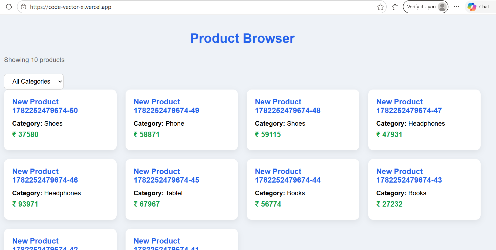
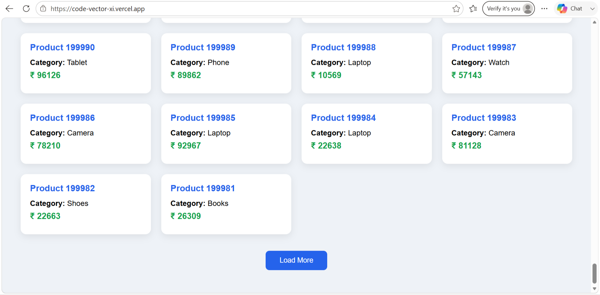

# Product Browser

A full-stack product browsing application built as part of the CodeVector Labs Backend Internship assignment. The application efficiently handles a large dataset of **200,000+ products** using **cursor-based pagination**, category filtering, and MongoDB indexing to provide fast and consistent browsing even when new products are added.

---

## Live Demo
https://code-vector-xi.vercel.app

---

## Features

- Generate and seed **200,000+ products**
- Cursor-based pagination
- Category filtering
- Stable sorting using `createdAt` and `_id`
- MongoDB compound indexes for faster queries
- Fast pagination without using `skip()` and `limit()` pagination
- React frontend for browsing products
- "Load More" functionality
- Handles concurrent data insertion without duplicate or missing products

---

## Tech Stack

### Backend

- Node.js
- Express.js
- MongoDB Atlas
- Mongoose

### Frontend

- React
- Vite
- Axios

### Deployment

- Render (Backend)
- Vercel (Frontend)

---

## Folder Structure

```
CodeVector/
│
├── backend/
│   ├── config/
│   ├── controllers/
│   ├── models/
│   ├── routes/
│   ├── scripts/
│   │   ├── seed.js
│   │   └── addProducts.js
│   ├── app.js
│   └── server.js
│
├── frontend/
│   ├── src/
│   └── public/
│
└── README.md
```

---

## Database Schema

Each product contains the following fields:

| Field | Type |
|------|------|
| _id | ObjectId |
| name | String |
| category | String |
| price | Number |
| createdAt | Date |
| updatedAt | Date |

---

## API Endpoint

### Get Products

```
GET /api/v1/products
```

### Query Parameters

| Parameter | Description |
|------------|-------------|
| category | Filter by category |
| cursorCreatedAt | Cursor timestamp |
| cursorId | Cursor ObjectId |

Example:

```
GET /api/v1/products?category=Laptop&cursorCreatedAt=2026-06-24T12:00:00.000Z&cursorId=685a5...
```

---

## Pagination Strategy

The application uses **cursor-based pagination** instead of traditional offset pagination.

Products are sorted by:

```javascript
{
    createdAt: -1,
    _id: -1
}
```

The cursor stores:

- createdAt
- cursorId

This ensures:

- Fast pagination
- Stable ordering
- No duplicate products
- No skipped products
- Correct results even when new products are inserted while a user is browsing

---

## Database Indexes

The following indexes are used:

```javascript
productSchema.index({
    createdAt: -1,
    _id: -1
});

productSchema.index({
    category: 1,
    createdAt: -1,
    _id: -1
});
```

These indexes optimize sorting and filtering queries over a large dataset.

---

## Seed Script

The project includes a seed script that generates **200,000 products** using batch insertion for improved performance.

Run:

```bash
npm run seed
```

---

## Testing Concurrent Inserts

A separate script inserts 50 new products to verify that cursor pagination remains consistent.

Run:

```bash
npm run addProducts
```

This demonstrates that users do not see duplicate or missing products while browsing.

---

## Local Setup

Clone the repository

```bash
git clone <repository-url>
```

Backend

```bash
cd backend
npm install
npm run dev
```

Frontend

```bash
cd frontend
npm install
npm run dev
```

---

## Environment Variables

Backend

```
PORT=
MONGODB_URI=
CORS_ORIGIN=
```

Frontend

```
VITE_API_URL=
```

---

## Future Improvements

- Infinite scrolling
- Search functionality
- Price range filtering
- Authentication
- Product details page
- API documentation using Swagger
- Docker support

---

## Screenshots

### Home Page


### Load More


---

## Developed by - Deeksha Shetty

